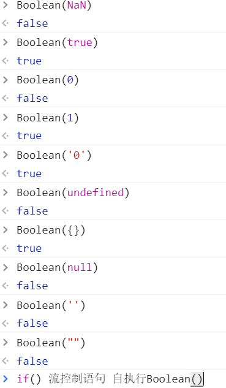
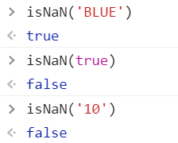
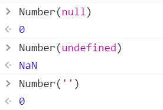

## 数据类型
1. **基本数据类型**
`undefined null boolean number string`
    
2. **引用数据类型**
   objec => 无序的键值对组成
    
3. **undefined**
   已定义未初始化、未定义
    
4. **null**
   *空对象指针 / 引用*
   undefined是null的衍生   null == undefined
    
5. **boolean()转型函数**

    
6. **NaN**
   **`typeof NaN = 'number'`**
   NaN不等于任何值，包括自己（*NaN == NaN = false 可以用来判断是否是NaN*）
   `0/0 = NaN    1/0 = Infinity   -1/0 = -Infinity`
   isNaN()  将可转化为数值的先转为数值再判断('10', true)
   
    
7. **Infnity**
   number.MAX_VALUE    number.MIN_VALUE
   isFinite() 判断是否在最小和最大数值之间
    
8. **Number()**

